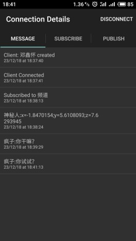

# 个人简历

## Reasearch

#### Detecting Room Structures Based on Smartphone

导师：jinZhang
创新实验课题，利用声波结合手机传感器构造出房间的轮廓

下面是报告链接（26页）

[<u>Report</u>](https://drive.google.com/open?id=1sJjOHRu13W4VcdquQ91LaJSBAstT52Um)

## Course Project

#### In-flight-entertainment-system

航班电影播放系统（三人项目）

- Java
- 项目得分 (97.4/100)
- Jsoup爬取资源
- 播放音乐，播放视频，进度条控制，倍速播放
- 历史，搜索，随机推荐，语言切换，主题切换
- 针对性设计：航班-->触摸or按键 操作

  
   

详情链接：[<u>github</u>](https://github.com/XinhhD/java2_Project_MoviePlayer)

#### Gobang

基于alpha-beta剪枝的min-max五子棋

- Python
- 决策树
- 剪枝
- 最大递归六层（4秒内做出决策）
- 棋力排名课程内 9/150

报告链接：

 <a href="GomokuReport_11610320.pdf"> <u>GomokuReport_11610320.pdf</u></a>

（未防抄袭尚未开源）

  

#### IMP

基于图论的影响力最大化问题

- Python
- 病毒式营销
- 社交网络
- NP-hard
- 得分排名课程内 6/150（分数：97/100）

  

报告链接：

 <a href="IMP_11610320.pdf"> <u>IMP_11610320.pdf </u></a>

#### SUSTech Card

校园式卡牌游戏（五人项目）

- Unity
- 南科大元素
- 仿昆特牌

  

#### MQTT

计算机网络期末项目（三人）

利用MTQQ(消息队列遥测传输)设计的物联网消息应用

- android
- 物联网
- TCP/IP
- 获取他人手机的三轴加速器信息

详情链接：[<u>github</u>](https://github.com/XinhhD/Mqtt)

  

